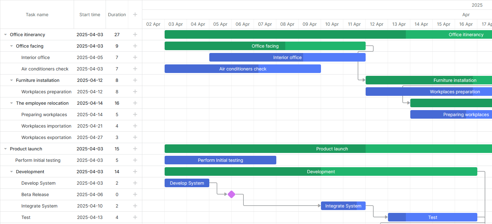

# React Gantt Quick-Start

[](https://dhtmlx.com/)

> Starter project showing how to use [DHTMLX React Gantt](https://dhtmlx.com/docs/products/dhtmlxGantt-for-React/) in a React App.




## How to start

### Online

[](https://codespaces.new/DHTMLX/react-gantt-quick-start/) 

### On the local host 

**Note**, `@dhx/react-gantt` and `@dhx/trial-react-gantt` are hosted on a private Npm registry. You need to configure your npm client and request access to them.

1. [Start a trial](https://dhtmlx.com/docs/products/dhtmlxGantt/download.shtml) to gain access to **@dhx** npm registry and follow the provided instructions for npm configuration.

2. Clone the repo and run 

```bash
git clone https://github.com/dhtmlx/react-gantt-quick-start.git
cd react-gantt-quick-start
yarn
yarn start
```

## Code example

The component allows simple declarative initialization:

```ts
import { useRef } from 'react';
import Gantt, { ReactGanttRef, Task, Link, GanttConfig } from '@dhx/trial-react-gantt';
import "@dhx/trial-react-gantt/dist/react-gantt.css";

export interface GanttProps {
  tasks: Task[];
  links: Link[];
}

export default function GanttChart({ tasks, links }: GanttProps) {
  const ganttRef = useRef<ReactGanttRef>(null);

  const config: GanttConfig = {
    grid_width: 500,
    scale_height: 90,
    scales: [
        { unit: 'year', step: 1, date: '%Y' },
        { unit: 'month', step: 1, date: '%M' },
        { unit: 'day', step: 1, date: '%d %M' }
    ]
  };

  return (
    <Gantt
      ref={ganttRef}
      tasks={tasks}
      links={links}
      config={config}
      data={{ 
        save: (entity: string, action: string, data: any, id: string|number) => {
            console.log(`${entity} - ${action} - ${id}`, data);
        }
      }}
    />
  );
}
```

Check the [Online documentation](https://docs.dhtmlx.com/gantt/web__react.html) to find more.

## Project structure

```
src/
  components/Gantt
    Gantt.tsx  <- <GanttChart /> component
  demoData.ts  <- minimal task/link arrays
  App.tsx      <- mounts Gantt
  main.tsx
public/
  index.html
```

## Want full-featured examples?

[Start your 30-day trial](https://dhtmlx.com/docs/products/dhtmlxGantt-for-React/download.shtml) to download the complete sample pack (auto-scheduling, resource histogram, Redux integration, etc.).

## License 

The code in this repository is released under the **MIT** License.

`@dhx/react-gantt` and `@dhx/trial-react-gantt` are commercial libraries - use them under a valid license or evaluation agreement.

## Useful links


- [Learn about DHTMLX React Gantt](https://dhtmlx.com/docs/products/dhtmlxGantt-for-React/)
- [Learn about DHTMLX Gantt](https://dhtmlx.com/docs/products/dhtmlxGantt/)
- [Technical support](https://forum.dhtmlx.com/c/gantt/react-gantt)
- [Online documentation](https://docs.dhtmlx.com/gantt/web__react.html)